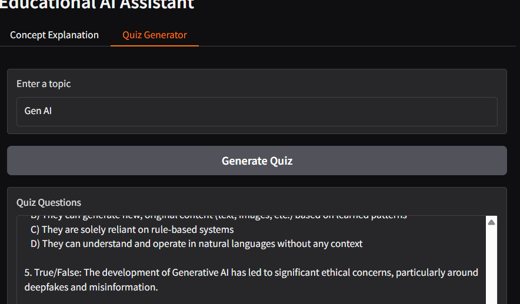

# Edu-Tutor-AI-IBM-Project

Edu Tutor AI:Personalized Learning
Team Leader
->Siva .R

Team Members
->Jalil
->Gunaseenan

Overview

Edu Tutor AI is an intelligent learning assistant designed to provide personalized education experiences for students. By leveraging artificial intelligence, adaptive learning algorithms, and data-driven insights, the platform tailors content, pace, and teaching style to suit each learner’s unique needs.

 Objectives

Edu Tutor AI aims to:

Deliver personalized learning paths based on student strengths, weaknesses, and preferences.

Provide real-time feedback and progress tracking.

Support multimodal learning (text, video, quizzes, interactive exercises).

Enhance student motivation with gamification and AI-driven encouragement.

Empower teachers/parents with insightful analytics on performance.

 Features

* AI-Powered Personalization – Adaptive recommendations for lessons, practice, and resources.

* Virtual Tutor Chatbot – 24/7 assistance for doubt-solving.

* Gamified Learning – Badges, leaderboards, and rewards to boost engagement.

Future Enhancements

* AI-generated personalized quizzes & study plans.

* Voice-enabled tutoring with speech recognition.

* AR/VR immersive learning experiences.

* Peer-to-peer AI-moderated study groups.

## Demo Video
Watch our project demo here: [Click to Watch](PASTE_YOUR_LINK_HERE)
## output image

